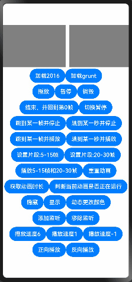

# lottie

## 简介

lottie是一个适用于OpenHarmony的动画库，它可以解析Adobe After Effects软件通过Bodymovin插件导出的json格式的动画，并在移动设备上进行本地渲染。




## 下载安裝

```
 ohpm install @ohos/lottie
```
OpenHarmony ohpm 环境配置等更多内容，请参考[如何安装 OpenHarmony ohpm 包](https://gitcode.com/openharmony-tpc/docs/blob/master/OpenHarmony_har_usage.md)

## 使用示例
### 完整示例
```
import lottie, { AnimationItem } from '@ohos/lottie';

@Entry
@Component
struct Index {
  // 构建上下文
  private renderingSettings: RenderingContextSettings = new RenderingContextSettings(true)
  private canvasRenderingContext: CanvasRenderingContext2D = new CanvasRenderingContext2D(this.renderingSettings)
  private animateItem: AnimationItem | null = null;
  private animateName: string = "animation"; // 动画名称

  // 页面销毁时释放动画资源
  aboutToDisappear(): void {
    console.info('aboutToDisappear');
    lottie.destroy();
  }

  build() {
    Row() {
      // 关联画布
      Canvas(this.canvasRenderingContext)
        .width(200)
        .height(200)
        .backgroundColor(Color.Gray)
        .onReady(() => {
          // 加载动画
          if (this.animateItem != null) {
            // 可在此生命回调周期中加载动画，可以保证动画尺寸正确
            this.animateItem?.resize();
          } else {
            // 抗锯齿的设置
            this.canvasRenderingContext.imageSmoothingEnabled = true;
            this.canvasRenderingContext.imageSmoothingQuality = 'medium'
            this.loadAnimation();
          }
        })
    }
  }

  loadAnimation() {
    this.animateItem = lottie.loadAnimation({
      container: this.canvasRenderingContext,
      renderer: 'canvas', // canvas 渲染模式
      loop: true,
      autoplay: false,
      name: this.animateName,
      contentMode: 'Contain',
      path: "common/animation.json",
    })
    // 因为动画是异步加载，所以对animateItem的操作需要放在动画加载完成回调里操作
    this.animateItem.addEventListener('DOMLoaded', (args: Object): void => {
      this.animateItem.changeColor([225, 25, 100, 1]);
      this.animateItem.play()
    });
  }

  destroy() {
    this.animateItem.removeEventListener("DOMLoaded");
    lottie.destroy(this.animateName);
    this.animateItem = null;
  }
}

```
### 注意事项
- 1.建议在 canvas 的 onReady 方法中加载动画，并在加载该动画之前先调用 lottie.destroy(name) 方法，以确保动画不会重复加载。
- 2.建议对动画animateItem的操作放在addEventListener的'DOMLoaded'回调监听中，确保在完全构建并解析完成后，再执行与动画相关的操作，从而避免潜在的加载顺序问题。因为如果是同一个代码块，动画的加载是异步加载的。
- 3.建议添加动画抗锯齿，如示例代码67到68行，以减少动画边缘的锯齿状现象，使动画画面更加平滑细腻，实现更佳的动画效果。
- 4.动画的销毁，推荐使用lottie.destroy(name)方法，相较于直接使用animateItem.destroy()，性能更友好。
- 5.建议在页面销毁或卸载时，将页面上所有的动画进行销毁，确保页面资源得到妥善管理和释放。
- 6.混淆模式编译报错，建议在对应的模块下的obfuscation-rules.txt文件添加配置：-keep ./oh_modules/@ohos/lottie。
- 7.建议canvas的宽高比例与动画的宽高比例保持一致。例如动画的宽高比是1000 * 2000（即1:2的比例），那么可以将canvas的宽高设置为 200 * 400，同样保持1:2的比例。建议canvas的宽高不要大于动画的原始宽高。
- 8.注意：加载外部资源图片时，若采用指定路径的方式：imagePath:'lottie/images/', 外部资源图片的路径是指rawfile目录下的或者沙箱里file目录下的路径。
- 9.Lottie的JSON文件中引用的外部图片资源，需要存放在rawfile目录下。例如json文件中 "u":"images/"，则在rawfile目录下创建一个名为images的文件夹，存放图片。

## 使用说明

### 前提：数据准备

lottie动画文件是由设计人员使用Adobe After Effects软件通过bodymovin插件导出json格式的文件。

AE软件创建动画时需要设置动画的宽(w)、高(h)、bodymovin插件的版本号(v)、帧率(fr)、开始帧(ip)、
结束帧(op)、静态资源信息(assets)、图层信息(layers)等重要信息。

如果仅是用于demo测试，可以使用[工程示例中的json文件](https://gitcode.com/openharmony-tpc/lottie/tree/master/entry/src/main/ets/common/lottie) 。

### 1.在相应的类中引入组件：

```
import lottie from '@ohos/lottie'
```

### 2.构建渲染上下文

```
  private mainRenderingSettings: RenderingContextSettings = new RenderingContextSettings(true)
  private mainCanvasRenderingContext: CanvasRenderingContext2D = new CanvasRenderingContext2D(this.mainRenderingSettings)
```

### 3.將动画需要的json文件放到pages同级别目录下，然后引用。(json路径为entry/src/main/ets/common/lottie/data.json)

注意：json文件路径不能使用 ./ 或者 ../ 等相对路径，相对路径获取不到动画源数据，会导致动画加载不出来,

传递给loadAnimation 方法的路径是相对于pages父文件夹为基准的，而index页面内引入的相对路径的动画是以index.ets文件为基准的，两者基准不一致。

所以如果json文件放置在pages文件夹下，路径应为 'pages/common/data.json' 样式

```
  private path:string = "common/lottie/data.json"
  或
  private jsonData:string = {"v":"4.6.6","fr":24,"ip":0,"op":72,"w":1000,"h":1000,"nm":"Comp 2","ddd":0,"assets":[],...}
```

### 4.关联画布

```
       Canvas(this.mainCanvasRenderingContext)
        .width('50%')
        .height(360 + 'px')
        .backgroundColor(Color.Gray)
        .onReady(()=>{
        //抗锯齿的设置
            this.mainCanvasRenderingContext.imageSmoothingEnabled = true;
            this.mainCanvasRenderingContext.imageSmoothingQuality = 'medium'
        })
```
注意：canvas设置的宽高比例建议和动画json资源里面的宽高比例一致，如：json动画资源里的宽高比例是 1:2 ，则canvas设置的宽高也是 1:2
- 想要的抗锯齿效果：mainCanvasRenderingContext.imageSmoothingEnabled = true 与 mainCanvasRenderingContext.imageSmoothingQuality = 'medium'

- 动画绘制前会对canvas画布进行清空处理，画布清空后再绘制动画。 

### 5.加载动画

- 加载动画的时机需要注意，点击按钮加载动画可按照正常逻辑放在点击事件内，如果想要实现进入页面自动播放动画，需要结合Canvas组件的onReady()生命回调周期实现，加载动画时机需放置在onReady()生命周期回调内或及之后。
- 同一Canvas组件加载多次/不同动画资源，需要手动销毁动画(lottie.destroy('name'))，之后才可再次加载其他动画资源。
```      
    lottie.destroy('2016'); //加载动画前先销毁之前加载的动画
    this.animationItem = lottie.loadAnimation({
            container: this.mainCanvasRenderingContext,  // 渲染上下文
            renderer: 'canvas',                          // 渲染方式
            loop: true,                                  // 是否循环播放,默认true
            autoplay: true,                              // 是否自动播放，默认true
            name: '2016',                                // 动画名称
            contentMode: 'Contain',                      // 填充的模式
            frameRate: 30,                               //设置animator的刷帧率为30
            imagePath: 'lottie/images/',                 // 加载读取指定路径下的图片资源
            path: this.path,                             // json路径
            initialSegment: [10,50]                      // 播放的动画片段
          })
     或      
    lottie.loadAnimation({
            container: this.mainCanvasRenderingContext,  // 渲染上下文
            renderer: 'canvas',                          // 渲染方式
            loop: true,                                  // 是否循环播放,默认true
            autoplay: true,                              // 是否自动播放，默认true
            contentMode: 'Contain',                      // 填充的模式
            frameRate: 30,                               //设置animator的刷帧率为30
            animationData: this.jsonData,                // json对象数据
            initialSegment: [10,50]                      // 播放的动画片段
          })
     或
    lottie.loadAnimation({
            uri: "https://assets7.lottiefiles.com/packages/lf20_sF7uci.json",  // uri网络资源
            container: this.canvasRenderingContext,                            // 渲染上下文
            renderer: 'canvas',                                                // canvas 渲染模式
            loop: true,                                                        // 是否循环播放,默认true
            autoplay: true,                                                    // 是否自动播放，默认true
            name: this.animateName,                                            // 动画名
          })
```

- 加载动画时，path 参数和 animationData 参数，二者选其一。
- path 参数：只支持加载entry/src/main/ets 文件夹下的相对路径，不支持跨包查找文件。
- animationData 参数：可结合ResourceManager进行读取资源文件内容进行设置。
- uri 参数：支持加载网络资源和通过URI路径方式加载动画，该方式需申请 ohos.permission.INTERNET，ohos.permission.GET_NETWORK_INFO两个权限。
- 加载外部资源图片：应用默认读取沙箱路径下的图片，如果沙箱下没有对应的资源图片，则会继续读取rawfile下的对应资源图片

### 6.HSP场景
- 为了适配HSP场景，loadAnimation接口新增当前场景上下文context可选参数传入，在HSP场景下需要传正确的context，非HSP场景不影响，context可以不传
```   
    let contexts = getContext(this).createModuleContext('library') as common.UIAbilityContext;
    lottie.loadAnimation({
            container: this.mainCanvasRenderingContext,  // 渲染上下文
            renderer: 'canvas',                          // 渲染方式
            loop: true,                                  // 是否循环播放,默认true
            autoplay: true,                              // 是否自动播放，默认true
            animationData: this.jsonData,                // json对象数据
            context: contexts,                           // 当前场景上下文context
            contentMode: 'Contain',                      // 填充的模式
            initialSegment: [10,50]                      // 播放的动画片段
          })
```

- 在HSP场景下，lottie加载动画json资源文件需通过animationData方式加载，需把动画json资源文件放在rawfile下进行读取加载：
- 加载动画时，animationData 参数。
- animationData 参数：可结合ResourceManager进行读取资源文件内容进行设置。

```   
    let resStr = new util.TextDecoder('utf-8',{ignoreBOM: true});
    let context = getContext(this).createModuleContext('library') as common.UIAbilityContext
    context.resourceManager.getRawFile('grunt.json',(err: Error,data: Uint8Array) =>{
      if(data === null || data === undefined || data.buffer=== undefined){
        return;
      }
      let lottieStr = resStr.decode(new Uint8Array(data.buffer));
      this.jsonData = JSON.parse(lottieStr);
    })
```

### 7.控制动画

- 播放动画

  ```
  lottie.play() //所有动画播放
  或
  animationItem.play() //当前指定animationItem动画播放
  ```

- 停止动画

  ```
  lottie.stop() //所有动画停止
  或
  animationItem.stop() //当前指定animationItem动画停止
  ```

- 暂停动画

  ```
  lottie.pause() //所有动画暂停
  或
  animationItem.pause() //当前指定animationItem动画暂停
  ```

- 切换暂停/播放

  ```
  lottie.togglePause() //所有动画切换暂停/播放
  或
  animationItem.togglePause() //当前指定animationItem动画切换暂停/播放
  ```

- 设置播放速度
  > 注意：speed>0正向播放, speed<0反向播放, speed=0暂停播放, speed=1.0/-1.0正常速度播放

  ```
  lottie.setSpeed(1) //所有动画设置播放速度
  或
  animationItem.setSpeed(1) //当前指定animationItem动画设置播放速度
  ```

- 设置动画播放方向
  > 注意：direction 1为正向，-1为反向

  ```
  lottie.setDirection(1) //所有动画设置播放方向
  或
  animationItem.setDirection(1) //当前指定animationItem动画设置播放方向
  ```

- 销毁动画
  > 注意：页面不显示或退出页面时，需要销毁动画; 可配合页面生命周期aboutToDisappear()及onPageHide(),或者Canvas组件的onDisAppear()使用

  ```
  lottie.destroy() //销毁所有动画
  或
  lottie.destroy('name') //销毁指定name动画
  ```

- 控制动画停止在某一帧或某一时刻
  > 注意：根据第二个参数判断按帧还是按毫秒控制，true 按帧控制，false 按时间控制，缺省默认为false

  ```
  animationItem.goToAndStop(250,true)
  或
  animationItem.goToAndStop(5000,false)
  ```

- 控制动画从某一帧或某一时刻开始播放
  > 注意:根据第二参数判断按帧还是按毫秒控制，true 按帧控制，false 按时间控制，缺省默认为false
  ```
  animationItem.goToAndPlay(250,true)
  或
  animationItem.goToAndPlay(12000,false)
  ```

- 限定动画资源播放时的整体帧范围，即设置动画片段

  ```
  animationItem.setSegment(5,15);
  ```

- 播放动画片段
  > 注意：第二参数值为true立刻生效, 值为false循环下次播放的时候生效

  ```
  animationItem.playSegments([5,15],[20,30],true)
  ```

- 重置动画播放片段，使动画从起始帧开始播放完整动画
  > 注意：参数值为true立刻生效, 值为false循环下次播放的时候生效

  ```
  animationItem.resetSegments(5,15);
  ```

- 获取动画时长/帧数
  > 注意：参数值为true时获取帧数，值为false时获取时间(单位ms)

  ```
  animationItem.getDuration();
  ```

- 添加侦听事件
  > 注意：添加和移除的事件监听，回调函数需是同一个，需预先定义，否则将不能正确移除

  ```
  AnimationEventName = 'drawnFrame' | 'enterFrame' | 'loopComplete' | 'complete' | 'segmentStart' | 'destroy' | 'config_ready' | 'data_ready' | 'DOMLoaded' | 'error' | 'data_failed' | 'loaded_images';
  
  animationItem.addEventListener("enterFrame",function(){
      // TODO something
  })
  ```

- 更改动画渲染颜色

  > 注意：第一个参数颜色是RGB/RGBA值，第二个参数是动画的层次 可不填，第三个参数是对应动画层次的元素的下标值 可不填

  ```
  animationItem.changeColor([255,150,203,0.8])  //修改整个动画的颜色
  或
  animationItem.changeColor([255,150,203,0.8],2) //修改该动画第二层的颜色
  或
  animationItem.changeColor([255,150,203,0.8],2,2) //修改该动画第二层第二个元素的颜色
  ```

- 移除侦听事件

  ```
  animationItem.removeEventListener("enterFrame",function(){
      // TODO something
  })
  ```

- 刷新动画布局

  ```
  animationItem.resize()
  ```

- 动画填充模式

  > 注意：动画填充模式共有5种：Fill,Cover,Top,Bottom,Contain，其中默认的填充模式是：Contain

  ```
  animationItem.setContentMode('Cover');
  
  ```

- 设置动画的刷帧率

  > 注意：设置动画animator的刷帧率，范围是1~120 帧率越大，功耗越严重

  ```
  animationItem.setFrameRate(30);
  
  ```

- 清除缓存文件
  > 注意：container是与canvas组件绑定的上下文CanvasRenderingContext2D,用于本地资源路径json文件
  ```
  lottie.clearFileCache() //清除所有动画缓存文件
  或
  lottie.clearFileCache('https://p3-dcd.byteimg.com/obj/motor-mis-img/5ec2c8af22bc17aedafe147a1d38f21d.json') //清除指定动画缓存文件
  或
  lottie.clearFileCache('common/lottie/data_url.json',container) //清除指定本地动画中网络资源缓存文件
  ```

### 8.动画销毁
- lottie销毁的时机：动画的销毁一般在canvas组件生命周期的onDisAppear()方法进行，或者在页面销毁时的aboutToDisappear()方法里执行
- 
- lottie销毁动画支持以下两种方式：
1. lottie.destroy：销毁所有动画播放，lottie.destroy(name)销毁指定name的动画。 建议使用该方式销毁动画
2. animationItem.destroy：销毁当前指定animationItem的动画播放,该销毁方式使用不当可能会引起内存泄漏问题，建议使用lottie.destroy(name)销毁方式。<br>
   
执行this.animationItem.destroy()，只会销毁name为2016的动画，name为cat的动画不会被销毁。建议：动画销毁时，使用lottie.destroy方式进行销毁。
  > 说明一：当同一个页面中存在多个动画，且动画实例赋值给同一个变量animationItem时，使用animationItem.destroy销毁动画时，只会销毁最后一个。如下代码示例，将name为cat和2016的动画同时赋值给this.animationItem，执行animationItem.destroy()销毁动画时，仅销毁最后加载的name为2016动画。name为cat的动画不会被销毁。
  ```
      this.animationItem = lottie.loadAnimation({
            container: this.mainCanvasRenderingContext,  // 渲染上下文
            renderer: 'canvas',                          // 渲染方式
            loop: true,                                  // 是否循环播放,默认true
            autoplay: true,                              // 是否自动播放，默认true
            name: 'cat',                                // 动画名称
            contentMode: 'Contain',                      // 填充的模式
            path: this.path,                             // json路径
            initialSegment: [10,50]                      // 播放的动画片段
          })
          
      this.animationItem = lottie.loadAnimation({
            container: this.mainCanvasRenderingContext,  // 渲染上下文
            renderer: 'canvas',                          // 渲染方式
            loop: true,                                  // 是否循环播放,默认true
            autoplay: true,                              // 是否自动播放，默认true
            name: '2016',                                // 动画名称
            contentMode: 'Contain',                      // 填充的模式
            path: this.path,                             // json路径
            initialSegment: [10,50]                      // 播放的动画片段
          })        
  
  ```

> 说明二：当lottie未加载完成前（ lottie.loadAnimation方法和下述方法在同一代码块中同时使用），调用下述方法可能导致设置无效：stop、togglePause、pause、goToAndStop、goToAndPlay、setSegment、getDuration、changeColor、setContentMode。<b>应将上述方法在动画加载完成之后再执行，通过animationItem.addEventListener('DOMLoaded')监听动画加载完成，示例如下：</b>
```
// 动画未加载完成，changeColor和setContentMode设置无效
Button('加载2016')
    .onClick(() => {
      if (this.animationItem2 == null) {
        this.animationItem2 = lottie.loadAnimation({
          container: this.canvasRenderingContext,
          renderer: 'canvas', // canvas 渲染模式
          name: '2016',
          path: "common/lottie/data.json", 
        })
        this.animationItem2.changeColor([255,150,203,0.8]);
        this.animationItem2.setContentMode('Top');
      }
    })
        
```

```
// animationItem.addEventListener('DOMLoaded')监听后执行方法，changeColor和setContentMode设置有效
Button('加载2016')
  .onClick(() => {
    if (this.animationItem2 == null) {
      this.animationItem2 = lottie.loadAnimation({
        container: this.canvasRenderingContext,
        renderer: 'canvas', // canvas 渲染模式
        loop: true,
        autoplay: false,
        name: '2016',
        contentMode: 'Contain',
        path: "common/lottie/data.json",
      })
  
      this.animationItem2.addEventListener('DOMLoaded', (args: Object): void => {
        this.animationItem2.changeColor([255,150,203,0.8]);
        // this.animationItem2.setContentMode('Top');
        // ...
      }); //动画加载完成，播放之前触发
    }
  })

```

### 9.关于混淆
- 代码混淆，请查看[代码混淆简介](https://docs.openharmony.cn/pages/v5.0/zh-cn/application-dev/arkts-utils/source-obfuscation.md)
- 如果希望lottie库在代码混淆过程中不会被混淆，需要在混淆规则配置文件obfuscation-rules.txt中添加相应的排除规则：
```
-keep
./oh_modules/@ohos/lottie
```
### 10.判断动画资源是否为网络加载使用示例
```
 this.isNet = '是否为网络加载' + this.animateItem.isNetLoad
```

### 11.日志开关功能
```
 LogUtil.mLogLevel = LogUtil.ON; 打开日志信息
 LogUtil.mLogLevel = LogUtil.OFF; 关闭日志信息
```

### 12.动画不可见时绘制

lottie支持动画滑动到不可见区域时，跳过绘制，减少冗余绘制(需要在API 13及以上的版本才支持该功能)。当前处理逻辑假定了lottie跟一个具体的canvas节点已经绑定，但是在一些复杂交互场景下，未能追踪绑定关系变化，使得UI逻辑存在复杂变化时出现不适用，包括：

- 预加载场景，此时canvas节点跟lottie尚无绑定关系。这又包括开发者显式预加载以及lazyforeach的cache机制引起的系统隐式预加载。
- 节点复用场景，此时节点可能会跟不同的动画形成绑定关系。
- 节点销毁后又重建的场景，此时旧节点已发生变化，新节点的关联关系被重新建立。

以上几种情况，当前都无法处理。导致lottie无法准确感知canvas节点状态，出现冗余绘制，甚至应该活动时不活动等明显的体验问题。 因此引入以CanvasRenderingContext2D为核心的协调员coordinator对象, 用来跟踪 lottie动画, CanvasRenderingContext2D, Canvas 三者之间的动态关联关系。 只有当lottie所关联CanvasRenderingContext2D对应了一个可见的canvas时，才会真正执行绘制，否则都会跳过绘制, 避免冗余负载。 当coordinator无法确认准确的canvas节点状态时, 引入兼容性处理：当用户未显式调用bindContext2dToCoordinator接口时，默认进行绘制，否则不进行绘制等进一步的回调通知。 为了避免兼容性处理考虑不周, 引入setAttachedCanvasHasVisibleArea接口，支持开发者强制修正context2d所关联的canvas节点状态，以便支持逃生。

使用示例：

 1. 使用canvas + lottie.loadAnimation方式
 在CanvasRenderingContext2D对象创建后，尚未被canvas引用前显示调用bindContext2dToCoordinator接口时，页面销毁时调用unbindContext2dFromCoordinator接口解除绑定。

```
import lottie from '@ohos/lottie'

@Entry
@Component
struct InvisibleAreaAutoPlay {
  private renderingSettings: RenderingContextSettings = new RenderingContextSettings(true);
  private canvas2D: CanvasRenderingContext2D = new CanvasRenderingContext2D(this.renderingSettings);

  aboutToAppear(): void {
    lottie.bindContext2dToCoordinator(this.canvas2D);
  }

  aboutToDisappear(): void {
    lottie.unbindContext2dFromCoordinator(this.canvas2D);
    lottie.destroy("robotYoga");
  }

  build() {
    Stack() {
      Canvas(this.canvas2D)
        .width(300)
        .height(300)
        .backgroundColor(Color.Gray)
        .onReady(() => {
          lottie.loadAnimation({
            container: this.canvas2D,
            renderer: 'canvas',
            loop: true,
            autoplay: true,
            contentMode: 'Contain',
            name: "robotYoga",
            path: "common/lottie/robotYoga.json"
          })
        })
    }.height('40%')
      .width('100%')
      .backgroundColor(Color.Gray)
  }
}
```


## 接口说明


| 使用方法                              | 类型                                | 相关描述                                                       |
|-----------------------------------|-----------------------------------|------------------------------------------------------------|
| play()                            | name?                             | 播放                                                         |
| stop()                            | name?                             | 停止                                                         |
| pause()                           | name?                             | 暂停                                                         |
| togglePause()                     | name?                             | 切换暂停                                                       |
| destroy()                         | name?                             | 销毁动画                                                       |
| goToAndStop()                     | value, isFrame?, name?            | 跳到某一时刻并停止                                                  |
| goToAndPlay()                     | value, isFrame?, name?            | 跳到某一时刻并播放                                                  |
| setSegment()                      | init,end                          | 设置动画片段                                                     |
| playSegments()                    | arr, forceFlag                    | 播放指定片段                                                     |
| resetSegments()                   | forceFlag                         | 重置动画                                                       |
| setSpeed()                        | speed                             | 设置播放速度                                                     |
| setDirection()                    | direction                         | 设置播放方向                                                     |
| getDuration()                     | isFrames?                         | 获取动画时长                                                     |
| addEventListener()                | eventName,callback                | 添加监听状态                                                     |
| removeEventListener()             | name,callback?                    | 移除监听状态                                                     |
| changeColor()                     | color, layer?, index?             | 更改动画颜色                                                     |
| setContentMode()                  | contentMode                       | 设置填充模式                                                     |
| setFrameRate()                    | frameRate                         | 设置动画刷帧率                                                    |
| cacheFileClear()                  | url?, container?                  | 清除文件缓存                                                     |
| bindContext2dToCoordinator()      | CanvasRenderingContext2D          | 跟踪 lottie动画, CanvasRenderingContext2D, Canvas 三者之间的动态关联关系  |
| unbindContext2dFromCoordinator()  | CanvasRenderingContext2D          | 解除追踪关系                                                     |
| setAttachedCanvasHasVisibleArea() | CanvasRenderingContext2D, boolean | 支持强制修正context2d所关联的canvas节点状态                              |


## 新增特性
1. 支持canvas渲染模式下动画的颜色修改
- 支持设置RGB格式颜色
- 支持设置RGBA格式颜色
- 支持设置起始关键帧颜色

2. 支持canvas渲染模式下动画的masks/mattes部分特性
- masks模式支持 mode = a, mode = s, mode = f 模式
- mattes模式支持 tt = 1, tt = 2 模式

3. 支持canvas渲染模式下动画的高斯模糊效果

4. 支持canvas渲染模式下加载外部资源图片
- 支持加载沙箱路径的外部资源图片(优先查找的路径)
- 支持加载rawfile目录下的外部资源图片

5. 支持设置填充模式
- Fill 填充拉伸(可能被拉伸、不会被裁剪)
- Top 等比填充-顶对齐(不会被裁剪、长边对齐)
- Bottom 等比填充-底对齐(不会被裁剪、长边对齐)
- Cover 等比缩放填充(可能被裁剪、断边对齐)
- Contain 等比填充-纵向中对齐(不会被裁剪、长边对齐)

6. 支持设置动画animator的刷帧率

7. 支持加载网络资源和通过URI路径方式加载动画
- 支持通过URI方式指定资源路径渲染动画
- 支持根据在线资源渲染动画
- 说明：如果lottie文件含有网络资源，需申请 ohos.permission.INTERNET，ohos.permission.GET_NETWORK_INFO两个权限

8. 支持当动画处于隐藏状态或完全不可见时，当前动画将自动暂停其向canvas底层发送绘制指令，以此优化性能并减少功耗

## 约束与限制

在下述版本验证通过：
- DevEco Studio: NEXT Developer Beta3(5.0.3.524), SDK: API12(5.0.0.25)
- DevEco Studio: NEXT Developer Beta1(5.0.3.122), SDK: API12(5.0.0.18)

## 目录结构

````
/lottie        # 项目根目录
├── entry      # 示例代码文件夹
├── library    # lottie库文件夹
│    └─ src/main/js   # 核心代码，包含json解析，动画绘制，操作动画
│          └─ 3rd_party    
│          └─ animation    
│          └─ effects      
│          └─ elements      
│          └─ modules
│          └─ renderers    
│          └─ utils
│          └─ EffectsManager.js  
│          └─ main.js
│          └─ mask.js
│       └─index.d.ts                
├── README.md     # 安装使用方法    
├── README_zh.md  # 安装使用方法                    
````

## 贡献代码

使用过程中发现任何问题都可以提交 [Issue](https://gitcode.com/openharmony-tpc/lottieArkTS/issues)，当然，也非常欢迎提交 [PR](https://gitcode.com/openharmony-tpc/lottieArkTS/pulls) 。

## 开源协议

本项目遵循 [MIT License](https://gitcode.com/openharmony-tpc/lottieArkTS/blob/master/LICENSE)。

## 不支持能力

* 不支持HTML渲染方式
* 不支持SVG渲染中filter效果
* 不支持动画中masks,mattes部分特性
* 不支持亮度遮罩模式，即：tt=3
* 不支持组件控制动画显示、隐藏
* 不支持注册动画
* 不支持查找动画
* 不支持更新动画数据
* 不支持部分效果
* 不支持含有表达式的动画
